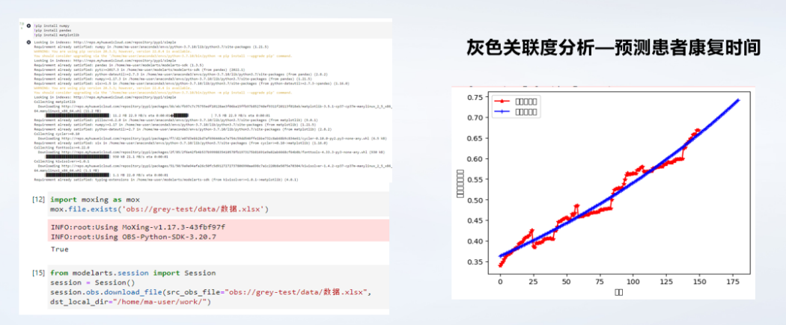

# 基于多数据融合的下肢康复外骨骼系统
## 一、背景介绍 
### 1.1 我国待康复人群庞大
我国自1999年步入老龄化社会以后，老龄化进程发展迅速。中国2002年64岁以上老年人占总人口比重达到7.08%，超过7%的临界点，中国进入老龄化阶段。
我国残疾人数量庞大，中国残疾人联合会调查结果显示，1987年我国各类残疾人总数约有5164万人。这一数据到2010年末已达8502万人，年复合增长率1.7%，据预测，至2020年残疾人数将突破1亿。目前只有不到10%的残疾人得到一定的康复服务。随着人们对健康需求不断提升，保守估算约60%的残疾人有康复需求，到2022年我国有将近6000万残疾患者需要康复治疗。
### 1.2 国内相关技术市场仍有空缺
随着OpenHarmony开源项目逐渐完善，于是，本项目大量的使用OpenHarmony的相应产品进行项目的技术开发，比如硬件方面，使用HI3861芯片来进行数据的传递，软件方面，通过开发鸿蒙APP，进行应用侧的展示，此外还通过华为云IOT平台对采集到患者的位移数据进行转存传输，最终储存在我们ECS弹性云服务器上进行算法训练。
# 二、项目痛点
## 2.1 国内相关康复医师缺口
随着生活节奏和饮食习惯的改变，脑卒中这一疾病，逐渐的年轻化，是心血管疾病中的高发病率疾病。在2019年五月份北京举办的中国脑卒中大会上所公布的数据显示，目前我国脑卒中患者有1242万人，有近一半的患者需要进行康复治疗，而我国康复医师占基本人群比例只有0.4：10万，和发达国家相比，我国有6.4万的康复医师缺口。 \
 
## 2.2 传统康复模式需要改进
由于传统康复多采用一对一的康复模式，无法满足当前市场的康复需求，并由于其花费大、周期长，对康复训练效果影响很大，也给家庭和社会产生了不稳定的因素。而康复外骨骼则可以辅助医师对患者进行康复训练，但是传统外骨骼由于体积较大，穿戴麻烦，舒适度较低且造价昂贵的缺点很难实现普及，因此新型康复外骨骼成为了研究热点。
# 三、项目架构
## 3.1 前端方面
### 3.1.1 鸿蒙app设计
对于人机交互界面，本项目选择以鸿蒙APP为平台，从图中可以看出，与设备连接启动后，会显示佩戴者的具体位置以及训练时从硬件获取到的3D动态图像。这些一方面可以方便家属得知患者位置，实时跟踪，另一方面可以根据该动态图像，并结合我们所推送的康复动作视频指导对患者动作进行及时的纠正和改善，从而患者的康复效率得到提高。在训练结束后，会对其训练过程中的数据进行整理分析，发送到我们数据展示页面中，能够将患者延续性护理的状况，如平衡能力的提升，走路稳定性的提升，病情在日周月的变化趋势，让患者看到自己病情的变换情况，对脑卒中偏瘫的再次复发起到预防作用。
### 3.1.2 基于润和DAYU200的OpenHarmony应用开发
本项目基于润和DAYU200进行多数据的展示，“润和大禹平台”是润和软件推出的可适用于多种智能通讯以及多媒体场景的智能硬件平台，集主芯片、射频器件、存储以及短距模块于一体，为多个行业智能终端（金融智能终端、能源智能终端等）提供基于DAYU200性能优越、稳定可靠的智能硬件底座。本项目从硬件端获取的3D图像和其他数据都是通过DAYU200展示给患者和医师。\

## 3.2 后端方面
### 3.2.1 数据库框架
首先，对注册、登录模块进行数据库的建表，这部分主要是对用户的一些基本信息进行录入。其次，我们对康复数据进行建表，主要是一些角度数据、时间、压力数据等。通过建表的方式，完成数据的进一步保存，将数据传入到数据库中。这一部分数据主要是展现给患者及其亲属查看的。最后则是康复系统模块所需要的数据，这一部分数据量庞大，通过建表，设置主键、外键的方式和其他几个表进行连接。这一部分数据是提供给医师，来进行康复诊疗评估的。
### 3.2.2 后端框架
我们主要采用的是Django框架，首先这个框架便于学习，其次通过使用Django框架，可以减少对数据库SQL语句的学习，因为Django有强大的数据库组件，对Sql语句使用要求较低。最后，Django框架有一个管理员身份，可以很好的帮助我们对后台部分的管理。在测试阶段，我们通过Django搭建后台，在未来上线时，我们则会逐渐的向着JAVA后台转换。
# 四、开发环境
开发鸿蒙app所用的DevEco 
Studio：https://blog.csdn.net/qq_40397259/article/details/113501475 \
开发后端所需要的Django、mysql、navicat、pycharm专业版 \
Django:https://blog.csdn.net/weixin_44293949/article/details/113071069 \
Navicat:https://blog.csdn.net/qq_45333183/article/details/107631118 \
Pycharm专业版：https://zhuanlan.zhihu.com/p/163521228 \
Mysql：https://blog.csdn.net/qq_42780885/article/details/123076558 \
https://blog.csdn.net/weixin_45884316/article/details/108284018?ops_request_misc=
# 五、设计思路
## 5.1 系统架构图
本项目的系统架构，分为感知层、平台层、应用层，通过HI3861和感知层的各种传感器（小熊派（E53-SC2））收集人体各部位数据，通过华为云IOT平台进行数据转发，储存在部署在ECS服务器的数据库当中。此外，我们也自主研发了人形线图算法、标准值对比、DTW+皮尔逊相关系数算法，部署在ECS服务器中，通过对患者运动数据的分析，评定患者康复等级。
同时，我们也基于ModelArts平台进灰色关联度模型的部署及训练，通过API调用，实现对患者康复时长预测，计划通过DAYU200进行应用侧展示
 \
## 5.2 程序流程图
为了让患者更好的操控下肢外骨骼，软件的整体流程图为用户使用自主研发的部署在DAYU200上的鸿蒙APP，进行对下肢外骨骼整体运动的控制。同时，康复评估系统处理后的数据也会在鸿蒙APP上进行展示，加强外骨骼整体的反馈能力。
 \
## 5.3 软硬件工具
硬件由下肢康复外骨骼对患者进行康复训练。按照人体下肢活动机理及康复训练的基本要求来确定关节自由度的分配、关节活动的局限及轻量化等设计指标，并完成外骨骼的总体结构设计，该结构设计可以调整满足不同体型患者的要求。
软件为鸿蒙APP进行康复动作的播放，康复外骨骼的控制与康复评估的生成等，并且集成了自主研发的康复评估系统。还采用的是华为前端进行开发，我们设计脑卒中延续性护理APP，用于展示患者病情。产品从患者，家属以及医生等多角度出发，软件分为患者端和医生端。患者端主要是对居家患者的训练周期、训练方式和训练效果等信息进行显示。医生端主要是对医生负责的患者信息进行显示，并将其近阶段具体的康复数据展示出来。 \

# 六、实现原理
## 6.1基于柔性气压驱动的五连杆自适应结构设计
本项目采用柔性气压的气缸驱动，相较于市面上采用的电机驱动，更能符合人体肌肉运动，减少康复对患者造成的二次损伤。并且膝关节处采用自主设计的五连杆齿轮结构，满足人体膝关节运动宏观自由度的同时自适应膝关节的微观自由度，进一步提高项目的舒适度。 \
 \
同时为了实现对气缸在不同时间伸长量的精准控制，团队自主设计了基于小熊派Hi3861的PID-PWM算法。此外，产品还具有智能端交互功能，以便与患者通过客户端对外骨骼进行无线操控。
(PID控制由比例单元P、积分单元I和微分单元D组成。PID控制的基础是比例控制P，就是气缸离目标位置越近速度越慢;积分控制I是来消除外界稳定因素干扰的误差，而微分控制D主要是减少气缸因为提高响应速度而超出位置的误差，而闭环控制是相较于开环多了反馈，来纠正与期望值的偏差，大大提高了稳定性) \

## 6.2基于“端网云用”物联生态下肢康复评估系统架构
项目通过小熊派扩展版E53-SC2的MPU6050模块，收集人体各关节运动数据，并将数据上云进行康复评估算法分析处理，最终通过部署在DAYU200上的鸿蒙APP进行应用侧展示。 \

## 康复评估算法主要采用了四种算法对患者的运动数据进行分析
### 6.2.1 人形线图
人形线图是一种可视化工具，用于展示人体运动的运动轨迹和姿势。
在项目中，我们通过MPU6050采集患者各关节角度的数据，让患者可以直观的看到自己的运动状态。\

### 6.2.2 标准值对比
项目使用Brounnstrom标准量表中的标准值，将患者的测试结果与标准中的参数进行对比评价患者功能能力。我们对两个动作之间的误差进行分析，并以这种可视化的线图进行显示。误差分析的结果能用来对患者的动作进行差距评定，进而可以对患者的康复训练方案提出意见。 \

## 6.2.3 效果相关性对比
通过自主设计的融合皮尔逊相关系数的DTW算法对患者训练前后疗程结果进行对比，从而评估患者康复进程及康复方案效果。通过DTW算法将两个不同时长的动作进行时序同步，并将时序规整后的患者和正常人的运动数据，加入了皮尔逊相关系数评估患者不同康复周期的动作数据与正常人动作数据的相似度。\
 \
 \

### 6.2.4 基于ModelArts的灰色关联度算法
我们充分使用华为云的云上资源，将我们的算法进行部署训练，大大提高我们的算法预测效率，加入灰色关联度分析预测患者康复时间，由图可得患者大约在44天后恢复。 \

# 七、功能介绍
下肢外骨骼硬件平台通过为患者提供高重复性的任务导向性训练，以诱导持久性的运动学习及神经重塑，能够有效改善脑卒中患者的步行功能。
基于OpenHarmony的下肢康复外骨骼评估平台，可对患者的康复训练动作进行全天候的记录及检测，并对患者动作进行评定，且可以进行康复训练中的设备监测以及康复训练后的效果评估。从而形成一套患者可自主康复训练的无医师康复解决方案，便于医师对患者的康复情况进行评估并提出一些主客观性的建议，同时患者也能更直观的看到康复情况，进而开始下一步的康复训练。 整体框架如下图: \

## 7.1 基于数据交叉思想的康复训练评估算法
我们将传统的惯性动捕设备与陀螺仪模块相结合，能够检测患者的运动情况，及时对患者的康复情况进行评估分析，掌握患者的康复数据，以便接下来对患者进行更好地康复，采集使用者的运动数据，并将数据进行融合处理和交叉验证提高评估的准确性，并由系统对患者运动状态与正常人体运动状态对照，制定出更优的康复方案。
## 7.2 基于OpenHarmony的康复情况可视化
软件采用的是OpenHarmony进行开发，我们设计脑卒中延续性护理App，用于展示患者病情。产品从患者，家属以及医生等多角度出发，软件分为患者端和医生端，基于鸿蒙分布式多端部署，也设计了手表端。 患者端结合联动硬件设备进行辅助康复。基于鸿蒙多设备连接的功能，软件可以连接硬件设备并从中获取相应数据。从图中可以看出，与设备连接启动后，会显示佩戴者的具体位置以及训练时从硬件获取到的3D动态图像。这些一方面可以方便家属得知患者位置，实时跟踪，另一方面可以根据该动态图像，并结合我们所推送的康复动作视频指导对患者动作进行及时的纠正和改善，从而患者的康复效率得到提高。在训练结束后，会对其训练过程中的数据进行整理分析，发送到我们数据展示页面中，能够将患者延续性护理的状况，如平衡能力的提升，走路稳定性的提升，病情在日周月的变化趋势，让患者看到自己病情的变换情况，对脑卒中偏瘫的再次复发起到预防作用。 \

医生端主要是对医生负责的患者信息进行显示，并将其近阶段具体的康复数据展示出来，从而方便医生对患者近阶段的训练进行更精确的点评和指正，避免了医生在院目测患者动作进行评估，提高了检测准确性并将临床医生的工作效率提高50%以上。此外医生也可以将检测报告发送到患者端，让患者无需到院也可以得到医生的康复建议。\

## 7.3 开发情况记录
在此次的openharmony开发挑战赛期间，我们通过申请到的开发板，下载了开发所需要的软件，比如vmware、raidrive、hiburn、以及mobaxterm，之后学习了小熊派官方所给出的教程，配置了开发环境并且实操了几个例子，可以实现d6和d9案例与华为云iot平台的连接，之后，我们遇到了没有拓展板的窘境，好在团队成员及时的将拓展板邮递了过来，之后我们开始传输我们所需要的数据到华为云iot平台，这里讲解一下开发的过程，首先打开虚拟机，右键打开终端，输入ifconfig找到自己电脑的ip地址，之后在raidrive中设置环境，输入本机地址，需要输入的账号和密码都是bearpi，这样就可以远程映射文件了，映射好之后可以进入到mobaxterm中创建相关的代码，在之后对代码进行烧录，之后便可实现与华为云iot平台的连接，这里倒是很多的细节没有提到，具体的建议看小熊派官方的本站视频（在文档的最下方） 之后便是成功的将我们的数据传输到了华为云iot平台。 之后如果需要使用相关文件的话，这里建议可以下载好之后可以打开iot_cloud_cc文件来进行数据的传输，打开之后是不需要更改代码的，这个时候在编译好文件后可以进行烧录的，烧录文件的具体步骤有，打开setting将波特率设置为921600，再勾选自动烧录的按钮，开始选择文件，选择好文件后，便可以点击connect，再点击开发板的复位按键，便开始进行了烧录烧录好之后，点击disconnect，用自己接入的串口，也就是小熊派，打印日志查看是否能够成功传输。
# 八、应用场景
当一位脑卒中患者手术过之后，需要进行锻炼时，在经过一段时间的人工帮助后，老人觉得也不能一直麻烦自己的儿女，儿女们也都想找一个更加方便安全又快捷的方法帮助老人来进行锻炼，于是他们看到了我们的下肢外骨骼康复系统，儿女们打开手机，根据指示打开了相关的APP，而老人在外骨骼的帮助下，可以随意的每天进行锻炼，并且外骨骼还十分智能能够检测老人的运动距离和身体状况，而且儿女也可以通过相关APP获得消息，根据老人的情况为老人设定目标，同时可以通过APP展示出来，非常方便。
# 九、产品价值
本项目为一款基于OpenHarmony的下肢康复外骨骼评估系统，通过为患者提供高重复性的任务导向性训练，以诱导持久性的运动学习及神经重塑，能够有效改善脑卒中患者的步行功能，并通过本项目自主研发的康复评估系统，生成训练评估结果，便于医师对患者的康复情况进行评估并提出一些主客观性的建议，同时患者也能更直观的看到康复情况，进而开始下一步的康复训练，直至完成康复训练并且完成康复。
# 十、演示视频链接
https://www.bilibili.com/video/BV1ua4y1U7BE/?vd_source=86e37a49c65be3c229e62a2f2671eb43
